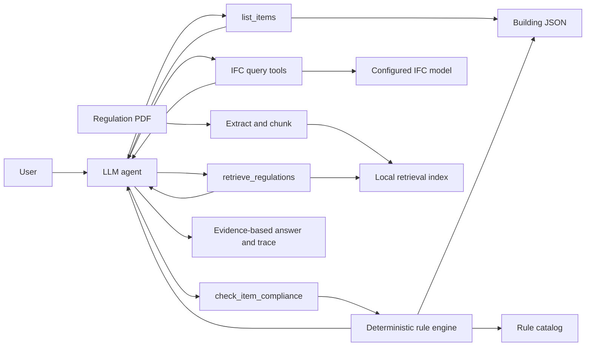

# Mini AEC Compliance Agent

An inspectable architecture, engineering, and construction (AEC) compliance
agent that combines LLM tool orchestration with deterministic Python rule
evaluation.

The model decides which evidence it needs. Python remains the source of truth
for `PASS`, `FAIL`, and `UNKNOWN` decisions.

> The JSON demo catalog is fictional. The IFC catalog contains one manually
> transcribed, source-linked prototype rule, but it has not been validated for
> legal use. This is not legal advice or production building-code software.

## What works today

- Natural-language compliance questions through Together AI
- Bounded multi-step function calling with retry handling
- Bounded user input, tool arguments, tool output, model output, and request bodies
- Discovery of doors, offices, and meeting rooms
- Deterministic, evidence-bearing rule checks
- Explicit `PASS`, `FAIL`, `UNKNOWN`, rule-level `NOT_APPLICABLE`, and not-found outcomes
- Read-only IFC4 parsing with IfcOpenShell
- IFC discovery by class and lookup by stable GlobalId
- IFC storey, nominal dimensions, property-set, and quantity extraction
- Typed route-applicability and clear-opening evidence; no silent width proxy
- Deterministic IFC door checks with field-level source provenance
- Separate versioned catalogs for fictional tests and source-derived IFC rules
- Rule evidence containing catalog version, clause, page, and verification status
- JSON tool traces for debugging and evaluation
- Per-run model-call, tool-call, token, step, and latency metrics
- Interactive and one-shot CLI modes
- FastAPI endpoints with generated OpenAPI/Swagger documentation
- Optional API-key protection for all versioned endpoints
- Opt-in OpenTelemetry spans with console or OTLP export
- Batch IFC compliance reports with JSON export
- Non-root, read-only Docker/Compose deployment with a health check
- Environment-backed configuration and text/JSON logging
- A 145-test offline suite with 87.16% branch coverage and an enforced 85% gate
- A six-case live agent behavior evaluation
- PDF extraction, page-aware chunking, reproducible indexing, and BM25 retrieval
- Agent regulation search with source URL, PDF page, chunk ID, and citation label
- An eight-case offline regulation retrieval benchmark

The regulation pipeline has processed the 179-page Hong Kong
`Design Manual: Barrier Free Access 2008 (2025 Edition)` into 245 local chunks.

## Architecture



The package is split into explicit boundaries. See
[`docs/architecture.md`](docs/architecture.md) for the request sequence, trust
boundaries, failure model, and design decisions.

- `repository.py` loads and validates source data.
- `compliance.py` applies deterministic rules.
- `ifc/service.py` performs bounded, read-only IFC queries.
- `regulations/` builds and searches source-bearing PDF chunks.
- `tools.py` exposes stable functions to the LLM.
- `agent.py` owns model calls, retries, tool dispatch, and traces.
- `config.py` owns environment-backed settings.
- `cli.py` is the process boundary for interactive use.

## Quick start

Requirements: Python 3.11-3.13 and
[uv](https://docs.astral.sh/uv/getting-started/installation/).

```bash
uv sync --locked --extra dev
```

Copy `.env.example` to `.env` and configure:

```text
TOGETHER_API_KEY=your_together_api_key_here
```

`.env` files are ignored by Git. Never commit a real model or service key, and
rotate a key immediately if it is printed, pasted, or otherwise exposed.

Run interactively:

```bash
uv run mini-aec-agent
```

Run one question and include the tool trace:

```bash
uv run mini-aec-agent --question "Which doors fail compliance?" --trace
```

Query the committed sample IFC model:

```bash
uv run mini-aec-agent \
  --ifc examples/sample_office.ifc \
  --question "List the doors in this IFC model with their GUIDs and widths" \
  --trace
```

The original entry point remains available:

```bash
uv run python main.py
```

## API and reports

Set `MINI_AEC_IFC_FILE=examples/sample_office.ifc` in `.env`, then run:

```bash
uv run mini-aec-api
```

Open `http://127.0.0.1:8000/docs` for interactive Swagger documentation. The
main endpoints are:

| Endpoint | Purpose |
|---|---|
| `GET /health` | Container and service health |
| `GET /v1/system` | Safe runtime capability flags |
| `GET /v1/ifc/summary` | IFC schema, project, and entity counts |
| `GET /v1/ifc/elements` | Bounded IFC class query |
| `POST /v1/ifc/checks` | Deterministic check by IFC GlobalId |
| `POST /v1/regulations/search` | Page-cited regulation retrieval |
| `POST /v1/agent/runs` | Natural-language agent execution |
| `POST /v1/reports/ifc-compliance` | Batch IFC compliance report |

Agent responses include operational metrics even when the detailed tool trace
is omitted:

```json
{
  "answer": "...",
  "steps": 2,
  "metrics": {
    "model_calls": 2,
    "tool_calls": 1,
    "prompt_tokens": 820,
    "completion_tokens": 96,
    "total_tokens": 916,
    "duration_ms": 1432.7
  }
}
```

For a shared deployment, set `MINI_AEC_SERVICE_API_KEY` and send it as the
`X-API-Key` header. Every `/v1` endpoint is then protected; `/health` remains
public for container probes. The Swagger schema exposes the same API-key
security scheme. Binding the API to `0.0.0.0` or `::` without a service key
fails closed unless the isolated-environment escape hatch is explicitly set.
The app enforces a 1 MiB body limit for declared and streaming requests. A
shared deployment must still terminate TLS and add proxy-level rate limits,
connection timeouts, and request limits; see [`SECURITY.md`](SECURITY.md).

OpenTelemetry is disabled by default. Set
`MINI_AEC_TELEMETRY_ENABLED=true` to emit agent, model, tool, and FastAPI spans.
Without an OTLP endpoint, spans are written to the console; set
`OTEL_EXPORTER_OTLP_ENDPOINT` to send them to a collector.

Generate a report without starting the API:

```bash
uv run python scripts/generate_ifc_report.py \
  --ifc examples/sample_office.ifc \
  --output artifacts/sample-report.json
```

Or start the containerized API, which uses the committed IFC sample by default:

```powershell
$env:MINI_AEC_SERVICE_API_KEY = "replace-with-a-unique-random-value" # pragma: allowlist secret
docker compose up --build
```

Compose publishes only to `127.0.0.1:8000`, requires the service key, drops all
Linux capabilities, enables `no-new-privileges`, and runs with a read-only root
filesystem as a non-root user.

## Example behavior

For the question:

> Which doors in the building fail compliance?

the expected tool flow is:

1. Discover every door with `list_items`.
2. Run `check_item_compliance` for every discovered door.
3. Synthesize the deterministic evidence without recalculating it in the LLM.

With the JSON demonstration data, only `Door-01` fails: its width is 850 mm
against the fictional 900 mm minimum. The committed IFC sample is evaluated
separately against the prototype Hong Kong BFA rule catalog: its 780 mm
`Door-01` fails the 800 mm threshold transcribed from clause 38 on PDF page 66.

## Configuration

| Variable | Default | Purpose |
|---|---:|---|
| `TOGETHER_API_KEY` | none | Required for live model calls |
| `MINI_AEC_MODEL` | `Qwen/Qwen3.5-9B` | Together model identifier |
| `MINI_AEC_TEMPERATURE` | `0` | Sampling temperature |
| `MINI_AEC_SEED` | `42` | Reproducibility seed |
| `MINI_AEC_MAX_AGENT_STEPS` | `8` | Infinite-loop guard |
| `MINI_AEC_MAX_OUTPUT_TOKENS` | `1024` | Per-model-call output cap |
| `MINI_AEC_MODEL_TIMEOUT_SECONDS` | `60` | Per-model-call timeout |
| `MINI_AEC_RETRY_DELAYS` | `1,2,4` | Transient retry delays in seconds |
| `MINI_AEC_LOG_LEVEL` | `INFO` | Application log level |
| `MINI_AEC_LOG_FORMAT` | `text` | `text` or `json` |
| `MINI_AEC_BUILDING_FILE` | `data/building.json` | Building data override |
| `MINI_AEC_REGULATIONS_FILE` | `data/regulations.json` | Rule catalog override |
| `MINI_AEC_IFC_FILE` | none | IFC model used by IFC query tools |
| `MINI_AEC_IFC_RULES_FILE` | BFA prototype catalog | Rules used for IFC checks |
| `MINI_AEC_REGULATION_PDF` | local BFA PDF path | Source PDF for indexing |
| `MINI_AEC_REGULATION_INDEX` | `data/processed/regulation_chunks.json` | Retrieval index |
| `MINI_AEC_API_HOST` | `127.0.0.1` | API bind host |
| `MINI_AEC_API_PORT` | `8000` | API bind port |
| `MINI_AEC_SERVICE_API_KEY` | none | Optional `X-API-Key` for all `/v1` routes |
| `MINI_AEC_ALLOW_INSECURE_PUBLIC_BIND` | `false` | Explicit isolated-network escape hatch |
| `MINI_AEC_PROJECT_ROOT` | auto-detected | Root for default data and `.env` paths |
| `MINI_AEC_TELEMETRY_ENABLED` | `false` | Enable OpenTelemetry instrumentation |
| `OTEL_SERVICE_NAME` | `mini-aec-compliance-agent` | Trace service name |
| `OTEL_EXPORTER_OTLP_ENDPOINT` | none | OTLP/HTTP trace endpoint; console when unset |

## Quality checks

All deterministic and agent-loop tests run without a live API call:

```bash
uv run pytest --cov=mini_aec_agent --cov-report=term-missing
uv run ruff check .
uv run ruff format --check .
uv run mypy
uv run bandit -r src rag evaluation scripts agent.py tools.py main.py -q
```

GitHub Actions runs linting, formatting, typing, tests, and packaging on Python
3.11, 3.12, and 3.13. Separate jobs audit locked dependencies, scan Python and
committed files for security issues and secrets, validate Compose, and build the
production image. Dependabot monitors Python, Docker, and GitHub Actions inputs.

The saved live evaluation can be refreshed separately:

```bash
uv run python -m evaluation.evaluate_agent
uv run python -m evaluation.evaluate_retrieval
```

Its six cases test single-item failure/pass, multi-rule rooms, category
discovery, complete multi-item checking, and missing-item behavior. This is a
small behavior regression suite, not a general measure of model or legal
accuracy.

The latest recorded live run (2026-08-29) completed all 6 evaluable cases with
no behavior, infrastructure, or execution errors. It averaged 1.83 tool calls
and 2.33 agent steps per case using `Qwen/Qwen3.5-9B`, `temperature=0`, and
`seed=42`. Treat this as a historical demonstration result and rerun it after
rotating credentials or changing the model, prompt, tools, or dependencies.

## Regulation retrieval

The source PDF is intentionally ignored by Git. Download it using the official
URL documented in `regulations/README.md`, save it as
`regulations/bfa_2008_2025.pdf`, and run:

```bash
uv run python -m rag.build_index
uv run python -m rag.retriever
```

Generated artifacts under `data/processed/` are also ignored. Retrieval results
preserve the document ID, URL, source name, PDF page, chunk ID, section hint,
matched terms, and citation label. The committed eight-case bootstrap benchmark
currently records Hit@5 and MRR; its scope note explicitly prevents presenting
the small benchmark as general retrieval accuracy.

## Repository layout

```text
mini-aec-agent/
├── .github/dependabot.yml
├── .github/workflows/ci.yml
├── SECURITY.md
├── Dockerfile
├── compose.yaml
├── data/
│   ├── building.json
│   ├── regulations.json
│   └── rules/bfa_2025_accessibility.json
├── docs/                        # architecture and interview demo guide
├── evaluation/
├── examples/
│   └── sample_office.ifc       # small IFC4 model for demos and tests
├── rag/                         # compatibility entry points for indexing
├── regulations/                 # source metadata; PDFs are ignored
├── src/mini_aec_agent/
│   ├── agent.py
│   ├── api/
│   ├── cli.py
│   ├── compliance.py
│   ├── config.py
│   ├── exceptions.py
│   ├── ifc/
│   │   └── service.py
│   ├── ifc_tools.py
│   ├── logging_config.py
│   ├── regulation_tools.py
│   ├── regulations/
│   ├── repository.py
│   ├── reports.py
│   └── tools.py
├── tests/
├── pyproject.toml
└── uv.lock
```

Root-level `agent.py`, `tools.py`, and `main.py` are compatibility shims for the
original prototype and existing evaluation code.

## Roadmap

1. Expand IFC adapters beyond door width to spaces and accessibility features.
2. Add human review workflows for promoting prototype rules to validated rules.
3. Add hybrid semantic retrieval only when benchmark results justify it.
4. Expand retrieval, citation, rule, latency, and cost benchmarks.
5. Add an AEC-oriented UI and optional BCF issue export.

## License

MIT
