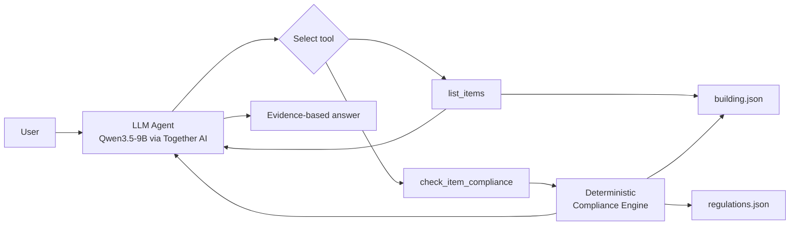

# Mini AEC Compliance Agent

A small, inspectable AI-agent prototype for architecture, engineering and construction (AEC) compliance workflows.

The project combines an LLM-based tool-using agent with a deterministic Python compliance engine. The LLM is responsible for understanding the user request, selecting tools and synthesizing the answer; Python code remains the source of truth for rule evaluation.

> **Important:** the building rules in this repository are fictional demonstration rules. This project is an educational/research prototype and must not be interpreted as real building-code or legal compliance software.

## Why this project

AEC workflows often require an AI system to do more than answer questions from text. A useful agent may need to discover building objects, retrieve structured properties, invoke domain tools, apply deterministic checks, and explain the resulting evidence.

This repository implements that pattern in a deliberately small environment that is easy to inspect, test and extend.

## Current capabilities

- Natural-language compliance questions
- Tool/function calling through Together AI
- Multi-step agent loop
- Discovery of building items by type
- Deterministic rule checking in Python
- Multiple rule types across doors and rooms
- Explicit PASS / FAIL / UNKNOWN outputs
- Missing-item handling
- Agent trace logging
- Unit tests for the deterministic layer
- A small reproducible agent-behaviour evaluation suite

## Architecture



The key design choice is that the LLM does **not** invent or calculate compliance decisions. It selects tools; the deterministic Python layer performs the actual checks.

## Example

Question:

> Which doors in the building fail compliance?

A typical tool trace is:

1. `list_items({"item_type": "door"})`
2. `check_item_compliance({"item_id": "Door-01"})`
3. `check_item_compliance({"item_id": "Door-02"})`
4. `check_item_compliance({"item_id": "Door-03"})`
5. Agent synthesizes the tool evidence into a final answer.

With the included demonstration data, Door-01 fails because its width is 850 mm while the fictional minimum is 900 mm.

## Repository structure

```text
mini-aec-agent/
├── data/
│   ├── building.json
│   └── regulations.json
├── evaluation/
│   ├── __init__.py
│   ├── evaluate_agent.py
│   ├── test_cases.json
│   └── results.json          # generated after evaluation
├── examples/
│   └── example_queries.md
├── tests/
│   └── test_tools.py
├── agent.py
├── tools.py
├── main.py
├── requirements.txt
├── .env.example
├── .gitignore
├── LICENSE
└── README.md
```

## Setup

### 1. Clone the repository

```bash
git clone <REPOSITORY_URL>
cd mini-aec-agent
```

### 2. Create a virtual environment

Windows PowerShell:

```powershell
python -m venv .venv
.\.venv\Scripts\Activate.ps1
```

macOS/Linux:

```bash
python3 -m venv .venv
source .venv/bin/activate
```

### 3. Install dependencies

```bash
pip install -r requirements.txt
```

### 4. Configure Together AI

Copy `.env.example` to `.env` and add a Together AI API key:

```text
TOGETHER_API_KEY=your_together_api_key_here
```

Never commit `.env` or an API key to GitHub.

## Run the agent

```bash
python main.py
```

Example queries:

```text
Is Door-01 compliant?
Which doors in the building fail compliance?
Which offices fail compliance?
Is Door-99 compliant?
```

More examples are available in `examples/example_queries.md`.

## Unit tests

The deterministic compliance layer is tested independently of the LLM:

```bash
pytest -v
```

The current test suite checks:

- door PASS/FAIL outcomes
- office multi-rule outcomes
- rule IDs and thresholds
- item retrieval
- item listing
- missing-item handling

This separation is intentional: deterministic correctness should not depend on an LLM call.

## Agent evaluation

Run:

```bash
python -m evaluation.evaluate_agent
```

The evaluator tests six demonstration cases covering:

| Case | Target behavior |
|---|---|
| `single_door_fail` | Correct single-item FAIL check |
| `single_door_pass` | Correct single-item PASS check |
| `single_room_fail` | Correct multi-rule room check |
| `all_doors` | Discovery + multiple compliance calls |
| `all_offices` | Discovery + multiple office checks |
| `missing_item` | Missing-item handling without inventing data |

The latest local run before repository packaging passed **6/6 demonstration cases**.

The script writes a machine-readable record to:

```text
evaluation/results.json
```

### Evaluation scope

The 6-case result is deliberately described as a **demonstration evaluation success rate**, not as a general “100% agent accuracy” claim.

The current evaluator checks expected tool use and deterministic tool outputs. It does not yet provide a full semantic judge of every natural-language statement in the final answer.

## Evaluation recording

The current demonstration benchmark contains six cases covering:

- single-item PASS/FAIL checks,
- multi-rule room evaluation,
- multi-step item discovery,
- multiple compliance-tool calls,
- and missing-item handling.

Latest recorded run:

| Metric | Result |
|---|---:|
| Total cases | 6 |
| Evaluable cases | 6 |
| Passed cases | 6 |
| Behaviour failures | 0 |
| Infrastructure errors | 0 |
| Execution errors | 0 |
| Behaviour success rate | 100% |
| Average tool calls / case | 1.83 |
| Average agent steps / case | 2.33 |

The model configuration for this run was fixed to `Qwen/Qwen3.5-9B`, `temperature=0`, and `seed=42`.

> This is a small demonstration benchmark rather than a general claim of 100% agent accuracy. The current evaluator focuses on expected tool use and deterministic tool outcomes.

## Design principles

### 1. LLM for orchestration, Python for truth

The model determines what information is needed and which tool to call. Numerical compliance decisions are produced by deterministic code.

### 2. Inspectable agent traces

Tool calls are recorded so agent behavior can be evaluated instead of judging only the final answer.

### 3. Separate unit testing and agent evaluation

`tests/` checks deterministic software behavior.

`evaluation/` checks agent-level task completion and tool use.

### 4. Explicit limitations

The current prototype uses small JSON datasets and fictional rules. It is a foundation for later AEC integrations, not a production compliance system.

## Current limitations

- No real statutory building regulations
- No PDF/RAG retrieval yet
- No BIM or IFC files yet
- No IfcOpenShell integration yet
- Small demonstration dataset
- Small six-case agent benchmark
- Final natural-language answers are not yet evaluated by a semantic judge
- No production security, latency or cost controls

## Roadmap

### Phase 1 — Current repository
- Structured JSON building data
- Structured demonstration rules
- Tool-using agent
- Multi-step function calling
- Deterministic checks
- Unit tests and agent evaluation

### Phase 2 — Regulation retrieval
- Parse a real public building-regulation document
- Chunk and index regulatory text
- Add retrieval with citations
- Connect retrieved clauses to deterministic checks

### Phase 3 — BIM / IFC
- Load IFC files with IfcOpenShell
- Query doors, spaces and properties from BIM
- Replace demonstration building JSON with IFC-derived data
- Preserve tool traces and evaluation

### Phase 4 — More reliable AEC agent
- Expand benchmark coverage
- Add tool-call failure handling
- Track latency/token cost
- Add semantic answer evaluation
- Compare single-agent and alternative orchestration strategies

## Technology

- Python
- Together AI
- Qwen3.5-9B
- Function/tool calling
- JSON
- pytest

## References

Together AI's current documentation describes multi-step function calling as an agent loop in which the model requests functions, the application executes them, and function results are fed back to the model for subsequent decisions or a final response.

## License

MIT License.
