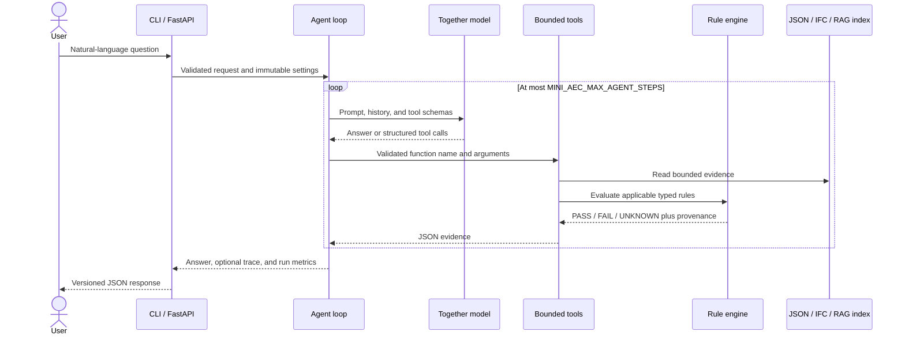

# Architecture

Mini AEC Compliance Agent separates probabilistic orchestration from
deterministic compliance decisions. The LLM selects tools and explains their
results; it cannot directly decide whether a building element passes a rule.

## Runtime request flow

## Components and responsibilities

| Component | Responsibility | Deliberate boundary |
|---|---|---|
| `agent.py` | Model calls, retries, step/output limits, tool dispatch, traces, metrics | Never performs numerical compliance decisions |
| `compliance.py` | Operator evaluation and outcome aggregation | Pure deterministic logic |
| `rule_models.py` | Strict versioned rule-catalog schema | Rejects unknown or malformed fields |
| `ifc/service.py` | Read-only IfcOpenShell queries and unit normalization | Bounded query sizes; no model mutation |
| `ifc/compliance.py` | Maps supported IFC entities into rule inputs | Preserves GlobalId and source field evidence |
| `regulations/` | PDF extraction, page-aware chunks, reproducible BM25 index | Retrieved text is evidence, not an instruction |
| `api/app.py` | Request validation, API-key gate, body limits, OpenAPI surface | Public binds fail closed without a key; `/health` stays public |
| `observability.py` | Opt-in FastAPI, agent, model, and tool spans | No exporter or telemetry overhead by default |

## Trust boundaries

The project treats four inputs differently:

1. User text and retrieved PDF text are untrusted. They may guide retrieval but
   cannot override the system prompt or deterministic results.
2. Model-produced tool arguments are parsed as JSON and checked again in the
   Python dispatcher. Tool arguments, per-result output, cumulative tool
   context, and agent steps are independently bounded.
3. Rule catalogs are validated by strict Pydantic models before evaluation.
4. JSON sources reject duplicate keys and non-finite numbers. Index, data, PDF,
   IFC, query, and collection sizes have explicit ceilings.
5. IFC data is read-only, queried with a fixed maximum result size, and linked
   back to stable GlobalIds in every finding.

These controls reduce prompt-injection and hallucination impact, but they do
not make the prototype suitable for legal sign-off. Source-derived rules remain
explicitly marked `prototype` until a qualified human validates the
transcription and applicability.

## Outcomes and failure model

- `PASS`: every applicable check passed.
- `FAIL`: at least one applicable check failed.
- `UNKNOWN`: required source data was missing or could not support a decision.
- `NOT_APPLICABLE`: a rule-level applicability condition was explicitly false;
  if no rule produces a decision, the overall result remains `UNKNOWN`.
- Request validation failures return HTTP 422.
- Project data/configuration errors return a generic HTTP 400 response while
  the non-sensitive error category remains in server logs.
- Invalid or missing configured API keys return HTTP 401.
- Declared or streaming request bodies over 1 MiB return HTTP 413.
- Transient model failures use bounded retries; the overall loop always stops
  at the configured step limit.

## Reproducibility and observability

- Model, temperature, seed, retry delays, source paths, and step limit are
  environment-backed settings.
- The retrieval index records source URL, source SHA-256, document ID, PDF page,
  chunk ID, and chunking parameters.
- Each agent run reports model calls, tool calls, prompt/completion/total tokens,
  steps, and end-to-end latency.
- OpenTelemetry spans can be sent over OTLP/HTTP or printed locally without
  changing application code.
- Offline tests replace model responses with deterministic fakes. Live model
  behavior and offline retrieval quality are evaluated separately so
  infrastructure failures are not mislabeled as reasoning failures.

## Deployment boundary

The bundled Compose service binds to loopback, requires a service API key,
drops Linux capabilities, enables `no-new-privileges`, and runs as a non-root
user with a read-only root filesystem. These controls do not replace TLS,
rate-limiting, network policy, connection timeouts, secret management, malware
scanning, or sandboxing for hostile native IFC/PDF inputs. Those belong at the
production platform boundary and are listed in `SECURITY.md`.

## Current scope

The implemented source-derived IFC adapter covers door clear width only when an
explicit `OnAccessibleRoute` boolean establishes applicability and an explicit
`ClearOpeningWidth` or `ClearWidth` property is encoded as an IFC length
measure. It deliberately does not infer route membership from geometry or
reinterpret `IfcDoor.OverallWidth` as clear width; missing or untyped evidence
produces `UNKNOWN`. The JSON dataset includes additional fictional
office and space rules to exercise the generic engine. Expanding to ramps,
stairs, sanitary facilities, spaces, BCF issues, or production review workflows
requires new reviewed adapters and rule catalog entries; it is intentionally not
hidden behind LLM reasoning.
